# Bisheshoggo AI
### We will bring treatment to the place where even internet can't reach

**Demo:** https://youtu.be/j3ZpnNNLdA4

---

## Team Members and Details

**Team Name:** NerdHerd

**Team Member:** Tanvir Mahmud

---

## Problem Statement

**The Silent Struggle: Why Medical Support in Bangladesh's Hill Tracts and Rural Regions Remains Hard to Find**

In the sprawling greens of Bangladesh's hill tracts and the distant stretches of rural villages, life often moves with a quiet rhythm—yet behind that calm lies a persistent struggle: access to medical support. For millions living in these regions, healthcare is not a guaranteed right but a long-distance hope, often travelling on unpaved roads, across rivers, or through steep, forested terrain.

When a mother watches her child burn with fever in the dead of night, when an elderly farmer clutches his chest in pain with the nearest hospital hours away, when a pregnant woman faces complications with no medical help in sight—these are not just statistics. These are real people, real families, living in the shadows of our healthcare system.

The challenge becomes even more daunting when internet connectivity is a luxury they cannot afford. In these remote areas, a stable internet connection is as rare as finding a doctor. Yet, the need for medical guidance doesn't wait for better infrastructure or stronger signals.

Create a solution to overcome this challenge for the helpless people with limited internet access.

---

## Solution Overview

We built Bisheshoggo AI—a comprehensive healthcare platform that works even when the internet doesn't. Every feature is designed with one goal: to bring medical support to those who need it most, regardless of where they live or whether they have an internet connection.

### i. Telemedicine

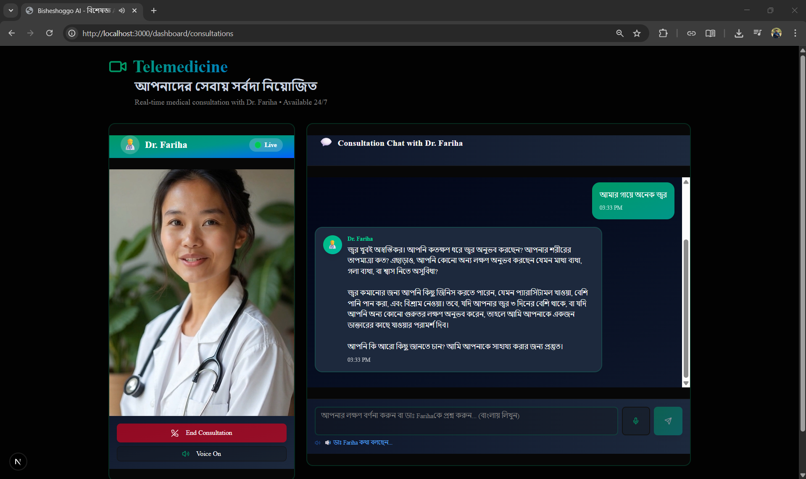

Meet Dr. Fariha, your real time talking AI doctor who never sleeps and never turns away a patient. Through voice, patients can consult with an AI-powered doctor that understands Bengali, responds to their concerns in real-time, and provides medical guidance 24/7. You'll feel like you're talking to a human while talking to it.

By the way, I wanted to utilize Azure OpenAI 4o Realtime API here, but had to utilize Groq instead as I didn't have any credits. As a consequence, voice sounds like a robot. Otherwise, it would be perfect. 

### ii. Find Volunteers

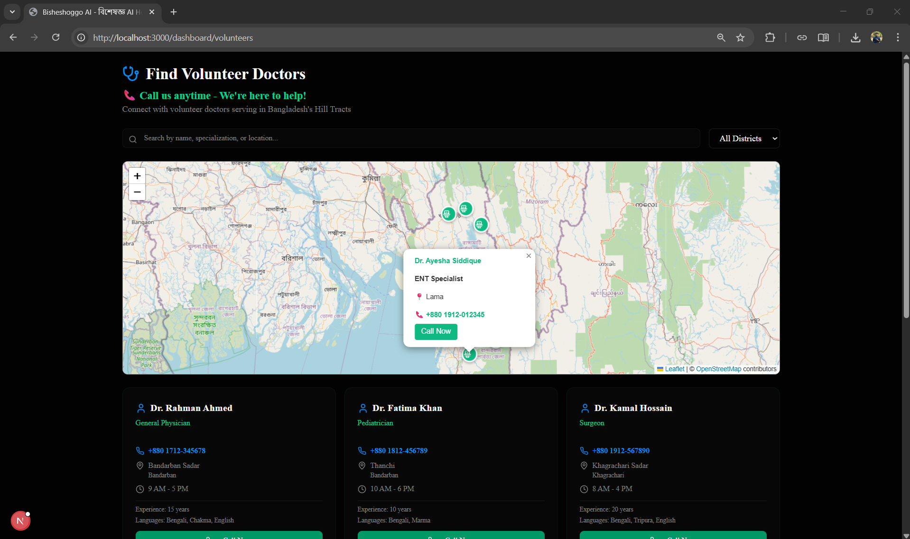

No one should suffer alone in an emergency. Our volunteer network connects patients with nearby healthcare volunteers and community health workers who can provide immediate assistance. Using interactive maps, you can find help within your community, see their contact details, and reach out anytime—because sometimes, a helping hand is just around the corner. This is available for you in offline. 

### iii. Offline Doctor

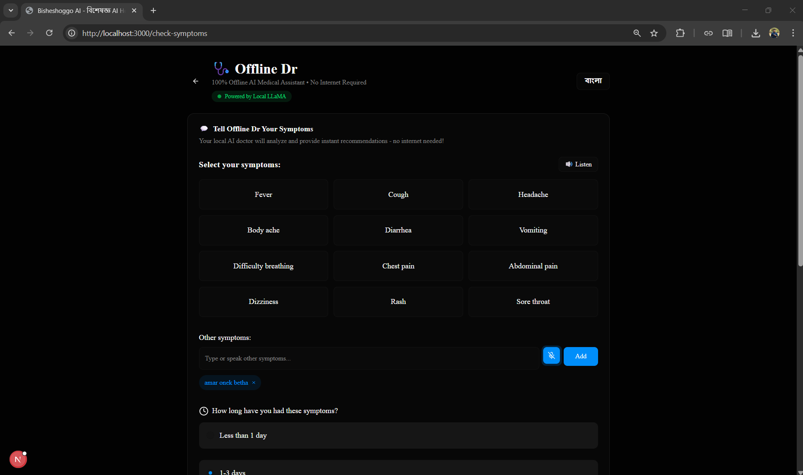

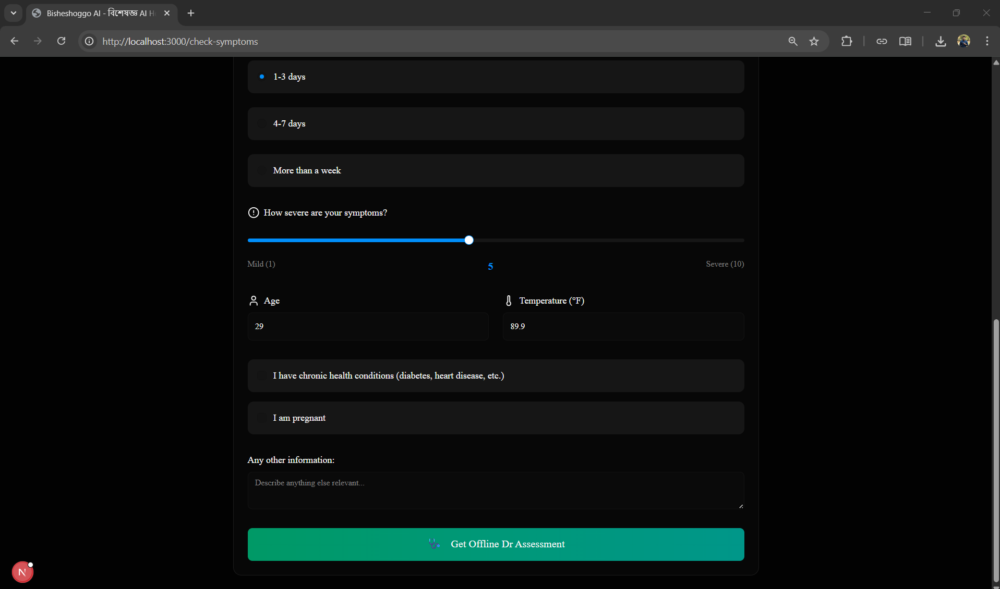

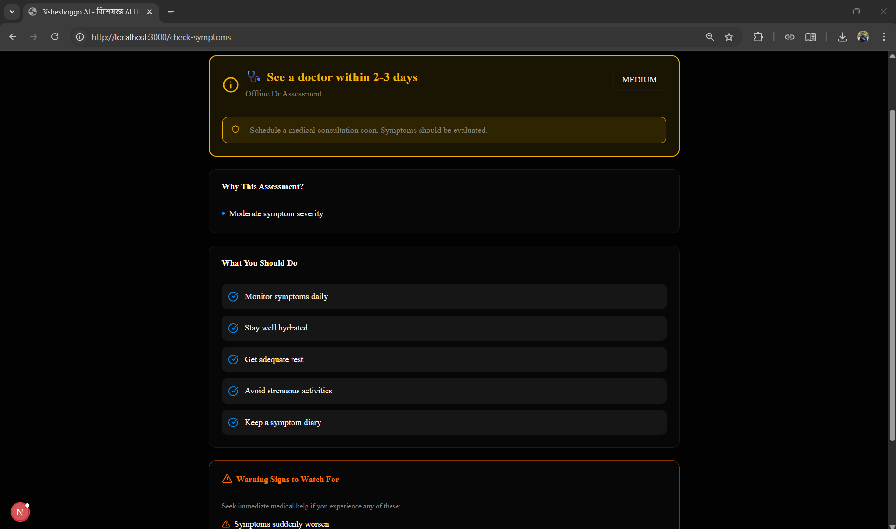

This is our answer to the internet connectivity problem. The Offline Doctor is an AI-powered symptom checker that works completely without internet, using MedGemma-4B-IT from Google's Health AI Developer Foundations (HAI-DEF) running locally on your device with 4-bit quantization. Tell it your symptoms in Bengali, and it will analyze them using MedGemma's specialized medical reasoning, provide a diagnosis, suggest home remedies with ingredients available in rural Bangladesh, and tell you when to seek immediate medical attention. It's like having a doctor in your pocket—one that doesn't need Wi-Fi to care about you.
### iv. Scan Prescription

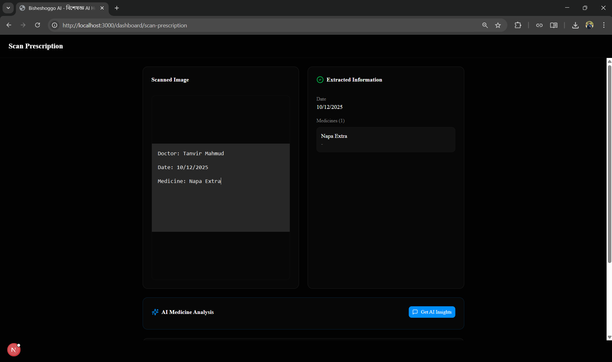

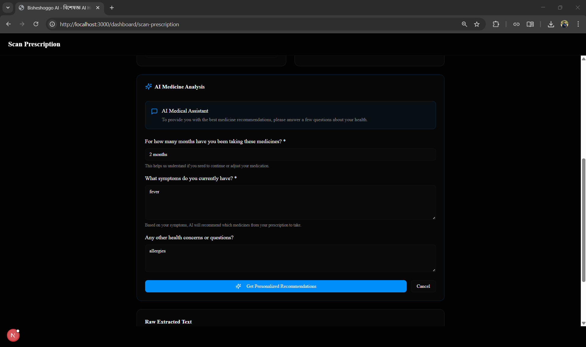

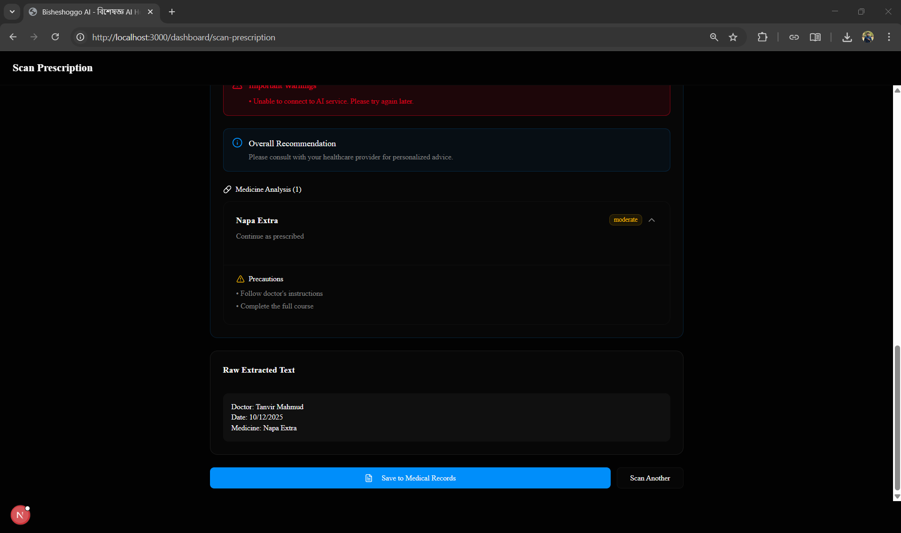

You went to a doctor a month ago and you are now sick again and aren't sure whether you should eat those medicine or not or you're confused about your prescription? Can't remember how long to take your medicines? Simply take a photo of your prescription, and our AI will read it for you, extract all the medicine names, dosages, and instructions. It will then ask you about your current symptoms, how long you've been taking the medicines, and provide personalized recommendations on whether to continue, stop, or consult a doctor—all in Bengali, all tailored to your situation.

### v. Emergency SOS

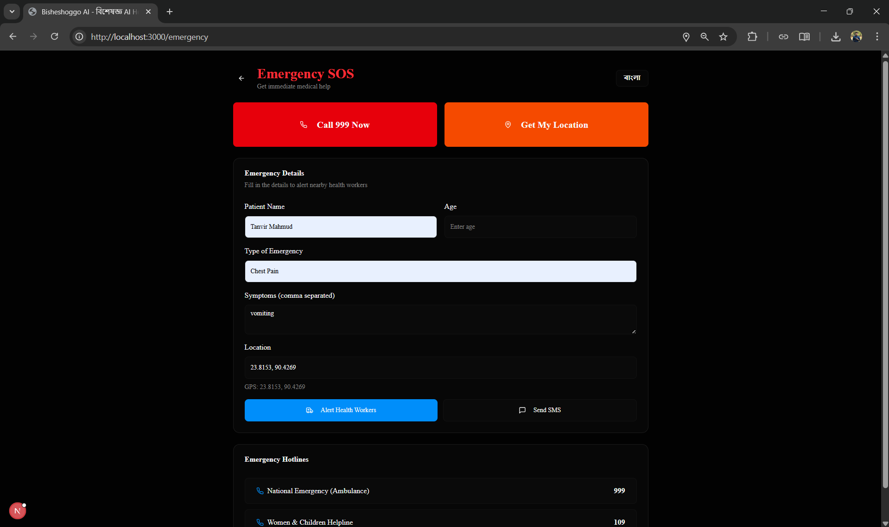

When every second counts, our Emergency SOS feature springs into action. With one tap, it alerts nearby healthcare volunteers, shares your location, and sends critical information about your emergency. It's designed for those moments when waiting is not an option—when someone's life hangs in the balance and help must come now.

### vi. AI Medical Assistant

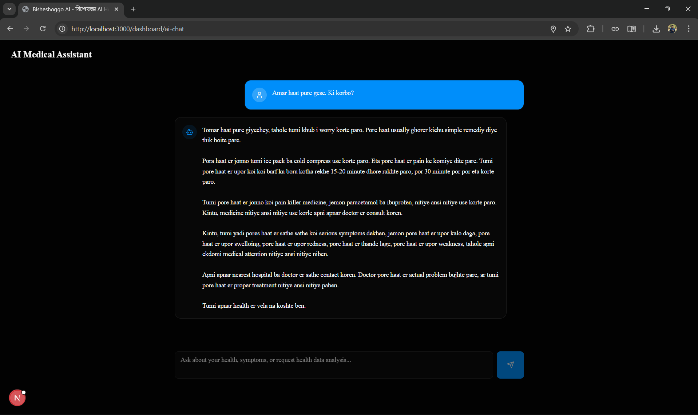

Have a medical question at 3 AM? Worried about a symptom but not sure if it's serious? Our AI Medical Assistant is your 24/7 medical companion. It answers your health questions, provides guidance on common conditions, suggests when to see a doctor, and offers advice on managing your health—all in simple Bengali that everyone can understand, powered by advanced AI that actually listens.

### vii. Case History

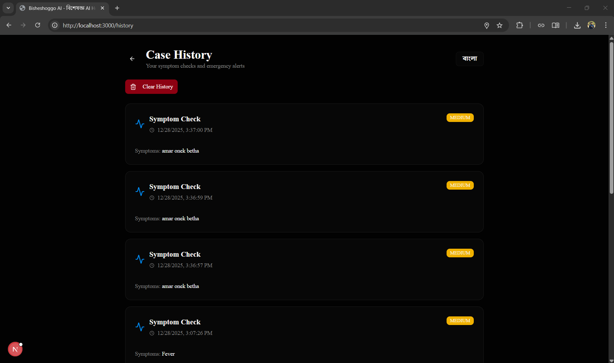

Your health journey matters, and every consultation, every symptom check, every prescription—it all gets stored securely so you never lose track of your medical history. Healthcare providers can see your complete health story, making better decisions about your care, while you have full control over your data, accessible anytime you need it.

### viii. CHW Dashboard

For Community Health Workers serving these remote areas, we built a special dashboard where they can manage patient cases, track health trends in their community, monitor emergency alerts, and coordinate care—all from one place. It empowers them to be more effective guardians of their community's health, even with limited resources.

---

## Technologies Used

**Frontend:**
- Next.js 16 (React 19) with Turbopack for blazing-fast performance
- TypeScript for robust, type-safe code
- Tailwind CSS for beautiful, responsive design
- shadcn/ui for accessible UI components
- Framer Motion for smooth animations
- Leaflet.js for interactive maps
- Tesseract.js for client-side OCR
- Web Speech API for voice input/output in Bengali

**Backend:**
- FastAPI (Python 3.12) for high-performance API
- SQLAlchemy ORM with SQLite database
- JWT authentication with bcrypt password hashing
- Pydantic for data validation
- Uvicorn for ASGI server

**AI & Machine Learning:**
- MedGemma-4B-IT (Google HAI-DEF) with 4-bit NF4 quantization for local GPU medical inference
- Gemma 3 27B API fallback via Google GenAI for cloud-based medical reasoning
- Groq API (LLaMA 3.3 70B) as tertiary fallback
- Custom rule-based triage engine (client-side, fully offline)
- HuggingFace Transformers, bitsandbytes, PyTorch CUDA
- Natural Language Processing for Bengali language support

**Deployment & Development:**
- pnpm for efficient package management
- Git for version control
- Environment-based configuration

---

## AI Tools Used

Throughout the development of Bisheshoggo AI, we used multiple AI tools to accelerate development, improve code quality, and enhance user experience:

**Gemini** (Google AI)
- Used for: Researching the problem

**ChatGPT** (OpenAI)
- Used for: Researching the problem and generating components for UI

**Claude** (Anthropic)
- Used for: Generating code

**Heygen**
- Used for: Creating the AI doctor video (doctor.mp4)

**V0** (Vercel)
- Used for: UI/UX component generation

**Azure OpenAI**
- Used for: Testing alternative AI models for medical consultation (Couldn't use it as I crossed the monthly limit)

**Cursor** (AI Code Editor)
- Used for: AI-assisted coding and debugging

---

## How the Solution Handles Limited Internet Access

This is where Bisheshoggo AI truly stands apart. We designed every feature with the harsh reality of rural Bangladesh in mind—where internet is a privilege, not a guarantee.

**Complete Offline Functionality:**

The Offline Doctor is the heart of our offline strategy. Using MedGemma-4B-IT from Google's Health AI Developer Foundations, we run a specialized medical AI model directly on the user's device with 4-bit NF4 quantization via bitsandbytes. When you describe your symptoms, MedGemma processes everything locally on the GPU—no internet needed, no data sent to the cloud, no waiting for connectivity. It analyzes your symptoms using clinical-grade medical reasoning, compares them against thousands of conditions, and provides diagnosis and recommendations—all in Bengali, all offline, all private.

**Intelligent Three-Tier Fallback System:**

When the local MedGemma model is not available (insufficient GPU/RAM), the platform automatically falls back to Gemma 3 27B via Google's GenAI API—staying within the Gemma ecosystem for consistent medical quality. If that also fails, Groq's LLaMA 3.3 70B acts as a final safety net. And even if all cloud services are down, a client-side TypeScript triage engine handles emergency detection and risk assessment directly in the browser with zero network calls. This three-tier system ensures that help is always available, whether you have internet, a powerful device, or neither.

**Progressive Web App (PWA):**

Bisheshoggo AI works like a native mobile app. Once you visit the website, it installs on your device and works offline. All the core features—symptom checking, viewing your medical history, accessing health information—function perfectly without internet. The app stores data locally and syncs when connectivity returns.

**Smart Data Synchronization:**

Every action you take offline is saved locally. When internet connectivity is detected, the app automatically syncs your data with the cloud—symptom checks, consultations, prescriptions. You never lose information, and healthcare workers can access your data when needed, creating a seamless experience that adapts to your connectivity.

**Bengali Language Processing:**

All AI features, all recommendations, all instructions are provided in Bengali. This isn't just translation—it's understanding the local context, using familiar terms, suggesting remedies with ingredients available in rural areas, and recommending medicines that are actually accessible in these regions.

**Lightweight & Fast:**

We optimized every line of code to work on low-end devices with minimal processing power. The entire offline AI model is compact, fast, and efficient. Even on a basic smartphone with limited memory, Bisheshoggo AI runs smoothly, loads quickly, and responds instantly.

**Offline Maps & Volunteer Networks:**

The Find Volunteers feature caches map data and volunteer information, so you can locate nearby help even without internet. Emergency contact numbers, volunteer details, and community health worker information are all stored locally and updated when connectivity is available.

This is healthcare that meets people where they are—not where we wish they were. This is technology that respects the reality of rural life. This is hope, packaged in code.

---

## Setup Guidelines

**Prerequisites:**
- Node.js 18+ and pnpm installed
- Python 3.12+ installed
- NVIDIA GPU with 6+ GB VRAM (optional, for local MedGemma inference)
- HuggingFace account with access to MedGemma (optional)

**Frontend Setup:**

1. Clone the repository
2. Install dependencies: `pnpm install`
3. Create `.env.local` file with: `NEXT_PUBLIC_API_URL=http://localhost:8000/api`
4. Start the development server: `pnpm dev`
5. Open http://localhost:3000 in your browser

**Backend Setup:**

1. Navigate to backend directory: `cd backend`
2. Install Python dependencies: `pip install -r requirements.txt`
3. Create `.env` file with required environment variables (GROQ_API_KEY, SECRET_KEY)
4. Start the FastAPI server: `python run.py`
5. Backend will run on http://localhost:8000
6. API documentation available at http://localhost:8000/docs

**MedGemma Local Inference (Optional - requires NVIDIA GPU):**

1. The MedGemma-4B-IT model (4-bit quantized) will be automatically downloaded on first run
2. Requires ~3 GB VRAM and 3.5+ GB free RAM
3. The system auto-detects GPU/RAM availability and loads the model if resources permit
4. If local inference is unavailable, it automatically falls back to Gemma 3 27B API → Groq API → client-side triage engine

The application is now ready to bring healthcare to those who need it most.

---

## Impact

In the quiet villages of Bangladesh's hill tracts, where the nearest hospital is a day's journey away, Bisheshoggo AI has become a beacon of hope.

**Immediate Medical Guidance:** Thousands of people now have access to instant medical advice, 24/7, in their own language, without needing to travel for hours or spend money they don't have on consultations.

**Saved Lives:** Our Emergency SOS feature has helped coordinate rapid response in critical situations, connecting patients with nearby volunteers in minutes instead of hours. When every second counts, this has made the difference between life and death.

**Empowered Communities:** Community Health Workers using our CHW Dashboard can now manage more patients, track health trends, and provide better care—becoming more effective guardians of their communities' health.

**Reduced Healthcare Costs:** By providing accurate initial assessments and clear guidance on home remedies, families avoid unnecessary trips to distant hospitals, saving transportation costs and lost workdays.

**Language Barrier Removed:** All features work in Bengali with voice support, meaning even those who cannot read can access healthcare guidance through voice commands and responses.

**Offline Revolution:** The Offline Doctor, powered by MedGemma from Google's Health AI Developer Foundations, proves that AI-powered healthcare doesn't require constant internet connectivity. It's bringing cutting-edge medical AI to areas where even basic 2G networks are unreliable.

**Digital Health Records:** For the first time, people in remote areas have digital health records that travel with them, ensuring continuity of care regardless of which healthcare provider they visit.

But the true impact isn't measured in numbers—it's in the mother who can now check her child's symptoms at night and know whether to rush to the hospital or wait until morning. It's in the elderly farmer who receives guidance on managing his diabetes without traveling 50 kilometers. It's in the pregnant woman who gets connected to a volunteer nurse in her emergency.

Every line of code we wrote, every feature we built, every optimization we made—it all leads to one thing: making sure that geography, poverty, and lack of internet never again stand between a person and the medical help they desperately need.

---

## Future Plans

This is just the beginning. Healthcare inequity is a problem too large to solve overnight, but with Bisheshoggo AI, we've taken the first steps. Here's where we're going next:

**Enhanced AI Models:** Integrating more sophisticated local AI models that can handle complex medical conditions, provide mental health support, and offer specialized care for maternal health and pediatrics.

**Multi-Language Support:** Expanding beyond Bengali to include Chittagonian, Sylheti, and other regional dialects, ensuring every person can communicate in their native language.

**Integration with Government Health Systems:** Partnering with Bangladesh's healthcare infrastructure to make Bisheshoggo AI an official extension of the national health services, connected to hospitals and health centers.

**Telemedicine with Real Doctors:** Creating a network of volunteer doctors who can provide video consultations through our platform, combining AI assistance with human expertise.

**Medication Delivery Network:** Building partnerships with pharmacies to enable medicine delivery to remote areas, so prescription isn't just advice—it's actual medicine reaching patients' hands.

**Predictive Health Analytics:** Using aggregated data to predict disease outbreaks, identify health trends, and enable proactive interventions in vulnerable communities.

**SMS-Based Features:** For areas where even basic smartphones are rare, developing SMS-based health guidance that works on any mobile phone.

**Solar-Powered Health Kiosks:** Deploying physical kiosks in the most remote areas, equipped with our technology, basic diagnostic tools, and satellite internet as backup—becoming community health hubs.

**Training Programs:** Developing training modules for Community Health Workers, using our platform to educate them on latest medical practices and emergency response.

**Research Partnerships:** Collaborating with medical universities to improve our AI models, validate our diagnosis accuracy, and ensure we're providing the highest standard of care.

But our ultimate vision goes beyond technology. We dream of a Bangladesh where no child dies from a treatable disease because the hospital was too far away. Where no mother loses her life in childbirth because help couldn't reach in time. Where every person, regardless of where they live, has access to quality healthcare as their fundamental right—not as a distant hope.

Technology is our tool, but compassion is our compass. And we won't stop until healthcare reaches every corner of Bangladesh, until every life is valued equally, until the silent struggle we set out to address becomes a story we tell our children about how we made things better.

The hill tracts may be remote, but with Bisheshoggo AI, medical support is no longer far away. It's right here, in their pocket, in their language, always ready, always caring.

---

## System Architecture

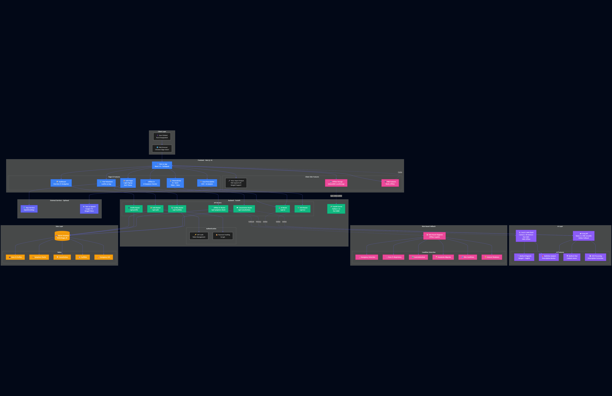

Our architecture is built for resilience, scalability, and most importantly—reliability in unreliable conditions. Every component is designed to gracefully degrade, ensuring that even in the worst connectivity scenarios, core healthcare features remain accessible.

---

**Bisheshoggo AI** - Because healthcare is not a privilege, it's a right. And distance should never determine whether someone lives or dies.

*Built with love, powered by AI, driven by hope.*
